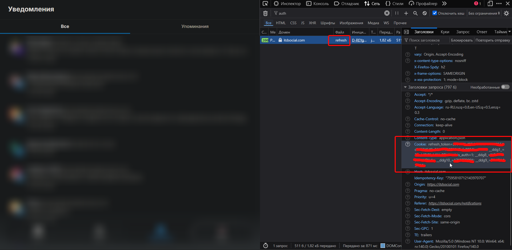

# itd-sdk
Клиент ITD для python
> [!CAUTION]
> ~~Мой основной аккаунт itd_sdk был забанен. Новый акк - itdsdk. #димонверниаккаунты~~
> ~~Проект больше не будет обнолвяться! яPR буду мержить~~
> ладно, буду мейнтйнить потихоньку...


## Установка

```bash
pip install itd-sdk
```

## Пример

```python
from itd import ITDClient

c = ITDClient('TOKEN', 'refresh_token=...; __ddg1_=...; __ddgid_=...; is_auth=1; __ddg2_=...; ddg_last_challenge=...; __ddg8_=...; __ddg10_=...; __ddg9_=...')
# можно указать только токен, тогда после просрочки перестанет работать, либо только куки чтобы токен сразу подтянулся, либо оба сразу

print(c.get_me())
```
<!--
> [!NOTE]
> Берите куки из запроса /auth/refresh. В остальных запросах нету refresh_token
>  -->

### Получение cookies

Для получения access_token требуются cookies с `refresh_token`. Как их получить:

1. Откройте [итд.com](https://xn--d1ah4a.com) в браузере
2. Откройте DevTools (F12)
3. Перейдите на вкладку **Network**
4. Обновите страницу
5. Найдите запрос к `/auth/refresh`
6. Скопируйте значение **Cookie** из Request Headers
> Пример: `refresh_token=123123A67BCdEfGG; is_auth=1`  
> В cookies также могут присутствовать значения типа `__ddgX__` (DDoS-Guard cookies) или `_ym_XXXX` (`X` - любое число или буква). Они необязательные и их наличие не влияет на результат


---
### Скрипт на обновление имени
Этот код сейчас работает на @itd_sdk (обновляется имя и пост)
```python
from itd import ITDClient
from time import sleep
from random import randint
from datetime import datetime
from datetime import timezone

c = ITDClient(None, '...')

while True:
    c.update_profile(display_name=f'PYTHON ITD SDK | Рандом: {randint(1, 100)} | {datetime.now().strftime("%m.%d %H:%M:%S")}')
    # редактирование поста
    # c.edit_post('82ea8a4f-a49e-485e-b0dc-94d7da9df990', f'рил ща {datetime.now(timezone.utc).isoformat(" ")} по UTC (обновляется каждую секунду)')
    sleep(1)
```

### Скрипт на смену баннера
```python
from itd import ITDClient

c = ITDClient(None, 'Ваши cookies')

c.update_banner('имя-файла.png')
print('баннер обновлен')

```

### Встроенные запросы
Существуют встроенные эндпоинты для комментариев, хэштэгов, уведомлений, постов, репортов, поиска, пользователей, итд.
```python
c.get_user('ITD_API') # получение данных пользователя
c.get_me() # получение своих данных (me)
c.update_profile(display_name='22:26') # изменение данных профиля, например имя, био итд
c.create_post('тест1') # создание постов
# итд
```

### Стилизация постов ("спаны")
С обновления 1.3.0 добавлена функция "спанов". Для парсинга пока поддерживается только html, но в будущем будет добавлен markdown.
```python
from itd import ITDClient
from itd.utils import parse_html

с = ITDClient(cookies='refresh_token=123')

print(с.create_post(*parse_html('значит, я это щас отправил со своего клиента, <b>воот</b>. И еще тут спаны написаны через html, по типу < i > <i>11</i>')))
```

<!-- ### SSE - прослушивание уведомлений в реальном времени

```python
from itd import ITDClient, StreamConnect, StreamNotification

# Используйте cookies для автоматического обновления токена
c = ITDClient(cookies='refresh_token=...; __ddg1_=...; is_auth=1')

for event in c.stream_notifications():
    if isinstance(event, StreamConnect):
        print(f'! Подключено к SSE: {event.user_id}')
    elif isinstance(event, StreamNotification):
        print(f'-- {event.type.value}: {event.actor.display_name} (@{event.actor.username})')
```

> [!NOTE]
> SSE автоматически переподключается при истечении токена

Типы уведомлений:
- `like` - лайк на пост
- `follow` - новый подписчик
- `wall_post` - пост на вашей стене
- `comment` - комментарий к посту
- `reply` - ответ на комментарий
- `repost` - репост вашего поста -->

### Кастомные запросы

```python
from itd.request import fetch

fetch(c.token, 'метод', 'эндпоинт', {'данные': 'данные'})
```
Из методов поддерживается `get`, `post`, `put` итд, которые есть в `requests`
К названию эндпоинта добавляется домен итд и `api`, то есть в этом примере отпарвится `https://xn--d1ah4a.com/api/эндпоинт`.

> [!NOTE]
> `xn--d1ah4a.com` - punycode от "итд.com"


## Прочее
Лицезия: [MIT](./LICENSE)  
Идея (и часть эндпоинтов): https://github.com/FriceKa/ITD-SDK-js
 - По сути этот проект является реворком, просто на другом языке

Автор: ~~[itd_sdk](https://xn--d1ah4a.com/itd_sdk) забанили~~ [itdsdk](https://xn--d1ah4a.com/itdsdk) (в итд) [@desicars](https://t.me/desicars) (в тг)
