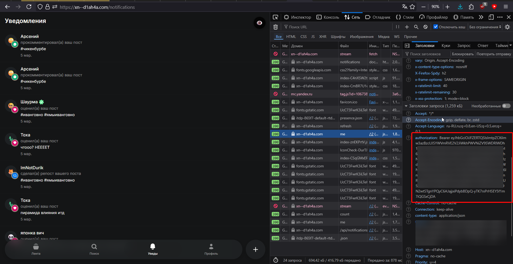
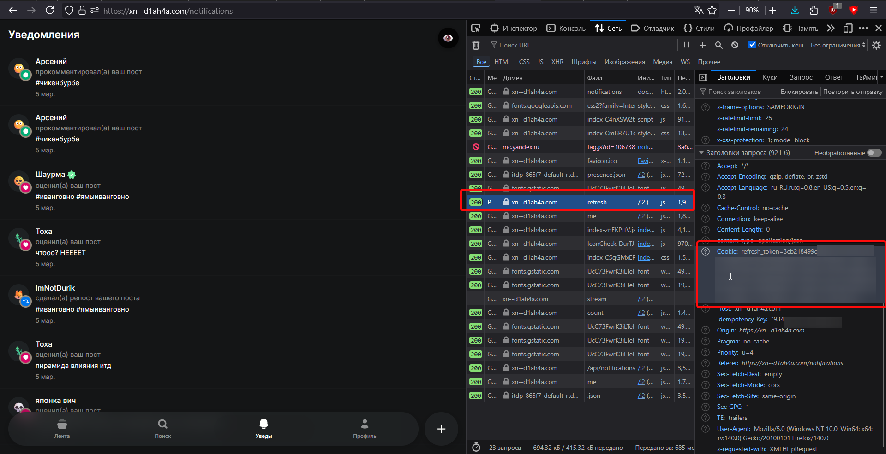

# Авторизация

## Способы авторизации
Чтобы получить доступ к аккаунту, потребуется `access` или `refresh` token.

 * `access_token` - JWT токен, действует около 15 минут, обновляется при перезагрузке страницы.
 * `refresh_token` - Случайная строка, действует более месяца, обновляется при выходе и повторном входе.

Найти `access token` можно в любом запросе в DevTools (открывается нажатием `F12`) во вкладке `Сеть` / `Network`:


Найти `refresh token` можно найти в запросе `/auth/refresh`:

!!! info
    Самое главное - "refresh token". Остальные куки - DDoS Guard и Яндекс Метрика


## Инициализация

=== "v1.0"

    ```python
    from itd import ITDClient

    # через refresh token
    c = ITDClient(cookies='refresh_token=xxx')

    # через access token
    c = ITDClient('eyXXX')
    ```

=== "v2.0 (в разработке)"

    ```python
    from itd import ITDClient

    # через refresh token
    c = ITDClient('xxx')

    # через access token
    c = ITDClient(access_token='eyXXX')
    ```
